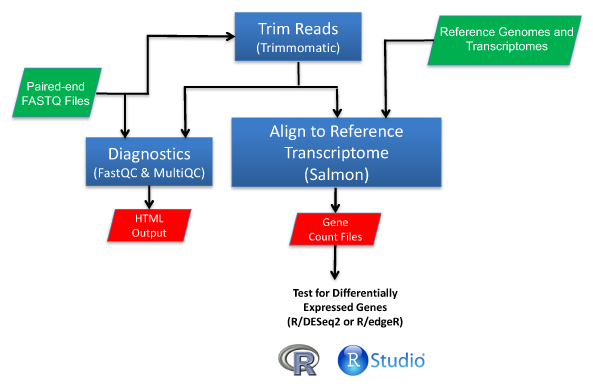
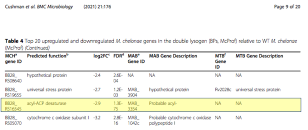
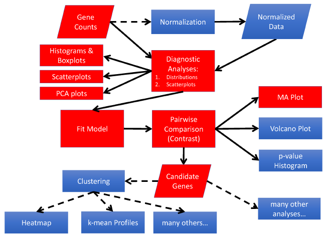

# RNA-Seq Analysis Training Demo

## Overview

This short tutorial demonstrates how to run an RNA-Seq workflow using a prokaryotic data set. Steps in the workflow include read trimming, read QC, read mapping, and counting mapped reads per gene to quantitate gene expression.



### STEP 1: Install Mambaforge and then install snakemake using bioconda.

First install Mambaforge.

```python
!curl -L -O https://github.com/conda-forge/miniforge/releases/latest/download/Mambaforge-$(uname)-$(uname -m).sh
!bash Mambaforge-$(uname)-$(uname -m).sh -b -u -p $HOME/mambaforge
!export PATH="$HOME/mambaforge/bin:$PATH"
```

Next, install Trimmomatic using bioconda.


!$HOME/mambaforge/bin/mamba install -y -c conda-forge -c bioconda trimmomatic
!$HOME/mambaforge/bin/mamba install -y -c conda-forge -c bioconda fastqc
!$HOME/mambaforge/bin/mamba install -y -c conda-forge -c bioconda multiqc
!$HOME/mambaforge/bin/mamba install -y -c conda-forge -c bioconda salmon

### STEP 2: Setup Environment

Create a set of directories to store the reads, reference sequence files, and output files.


!cd $HOMEDIR
!echo $PWD
!mkdir -p data
!mkdir -p data/raw_fastq
!mkdir -p data/trimmed
!mkdir -p data/fastqc
!mkdir -p data/aligned
!mkdir -p data/reference

### STEP 2: Copy FASTQ Files
In order for this tutorial to run quickly, we will only analyze 50,000 reads from a sample from both sample groupsinstead of analyzing all the reads from all six samples. These files have been posted on a Google Storage Bucket that we made publicly accessible.


!curl https://storage.googleapis.com/me-inbre-rnaseq-pipelinev2/data/raw_fastqSub/SRR13349122_1.fastq --output data/raw_fastq/SRR13349122_1.fastq
!curl https://storage.googleapis.com/me-inbre-rnaseq-pipelinev2/data/raw_fastqSub/SRR13349122_2.fastq --output data/raw_fastq/SRR13349122_2.fastq
!curl https://storage.googleapis.com/me-inbre-rnaseq-pipelinev2/data/raw_fastqSub/SRR13349128_1.fastq --output data/raw_fastq/SRR13349128_1.fastq
!curl https://storage.googleapis.com/me-inbre-rnaseq-pipelinev2/data/raw_fastqSub/SRR13349128_2.fastq --output data/raw_fastq/SRR13349128_2.fastq


### STEP 3: Copy reference transcriptome files that will be used by Salmon
Salmon is a tool that aligns RNA-Seq reads to a set of transcripts rather than the entire genome.

!curl https://storage.googleapis.com/me-inbre-rnaseq-pipelinev2/data/reference/M_chelonae_transcripts.fasta --output data/reference/M_chelonae_transcripts.fasta
!curl https://storage.googleapis.com/me-inbre-rnaseq-pipelinev2/data/reference/decoys.txt --output data/reference/decoys.txt


### STEP 4: Copy data file for Trimmomatic

!curl https://storage.googleapis.com/me-inbre-rnaseq-pipelinev2/config/TruSeq3-PE.fa --output TruSeq3-PE.fa

### STEP 5: Run Trimmomatic
Trimmomatic will trim off any adapter sequences or low quality sequence it detects in the FASTQ files.

!trimmomatic PE -threads 2 data/raw_fastq/SRR13349122_1.fastq data/raw_fastq/SRR13349122_2.fastq data/trimmed/SRR13349122_1_trimmed.fastq data/trimmed/SRR13349122_2_trimmed.fastq data/trimmed/SRR13349122_1_trimmed_unpaired.fastq  data/trimmed/SRR13349122_2_trimmed_unpaired.fastq ILLUMINACLIP:TruSeq3-PE.fa:2:30:10:2:keepBothReads LEADING:3 TRAILING:3 MINLEN:36
!trimmomatic PE -threads 2 data/raw_fastq/SRR13349128_1.fastq data/raw_fastq/SRR13349128_2.fastq data/trimmed/SRR13349128_1_trimmed.fastq data/trimmed/SRR13349128_2_trimmed.fastq data/trimmed/SRR13349128_1_trimmed_unpaired.fastq  data/trimmed/SRR13349128_2_trimmed_unpaired.fastq ILLUMINACLIP:TruSeq3-PE.fa:2:30:10:2:keepBothReads LEADING:3 TRAILING:3 MINLEN:36

### STEP 6: Run FastQC
FastQC is an invaluable tool that allows you to evaluate whether there are problems with a set of reads. For example, it will provide a report of whether there is any bias in the sequence composition of the reads.

!fastqc -o data/fastqc data/trimmed/SRR13349122_1_trimmed.fastq
!fastqc -o data/fastqc data/trimmed/SRR13349128_1_trimmed.fastq


### STEP 7: Run MultiQC
MultiQC reads in the FastQQ reports and generate a compiled report for all the analyzed FASTQ files.

!multiqc -f data/fastqc


### STEP 8: Index the Transcriptome so that Trimmed Reads Can Be Mapped Using Salmon

!salmon index -t data/reference/M_chelonae_transcripts.fasta -p 8 -i data/reference/transcriptome_index --decoys data/reference/decoys.txt -k 31 --keepDuplicates


### STEP 9: Run Salmon to Map Reads to Transcripts and Quantify Expression Levels
Salmon aligns the trimmed reads to the reference transcriptome and generates the read counts per transcript. In this analysis, each gene has a single transcript.

!salmon quant -i data/reference/transcriptome_index -l SR -r data/trimmed/SRR13349122_1_trimmed.fastq -p 8 --validateMappings -o data/quants/SRR13349122_quant
!salmon quant -i data/reference/transcriptome_index -l SR -r data/trimmed/SRR13349128_1_trimmed.fastq -p 8 --validateMappings -o data/quants/SRR13349128_quant


### STEP 10: Report the top 10 most highly expressed genes in the samples

Top 10 most highly expressed genes in the wild-type sample.


!sort -nrk 4,4 data/quants/SRR13349122_quant/quant.sf | head -10


Top 10 most highly expressed genes in the double lysogen sample.


!sort -nrk 4,4 data/quants/SRR13349128_quant/quant.sf | head -10


### STEP 11: Report the expression of a putative acyl-ACP desaturase (BB28_RS16545) that was downregulated in the double lysogen relative to wild-type
A acyl-transferase was reported to be downregulated in the double lysogen as shown in the table of the top 20 upregulated and downregulated genes from the paper describing the study.


Use `grep` to report the expression in the wild-type sample. The fields in the Salmon `quant.sf` file are as follows. The level of expression is reported in the Transcripts Per Million (`TPM`) and number of reads (`NumReads`) fields:  
`Name    Length  EffectiveLength TPM     NumReads`

!grep 'BB28_RS16545' data/quants/SRR13349122_quant/quant.sf


Use `grep` to report the expression in the double lysogen sample. The fields in the Salmon `quant.sf` file are as follows. The level of expression is reported in the Transcripts Per Million (`TPM`) and number of reads (`NumReads`) fields:  
`Name    Length  EffectiveLength TPM     NumReads`

!grep 'BB28_RS16545' data/quants/SRR13349128_quant/quant.sf


### The next tutorial will focus on the analysis of the gene counts

Now that you have read counts per gene, the next tutorial will show you the following workflow that is used to generate the list of differentially expressed genes.


