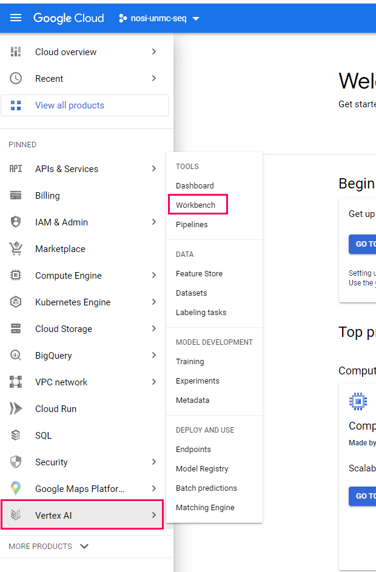
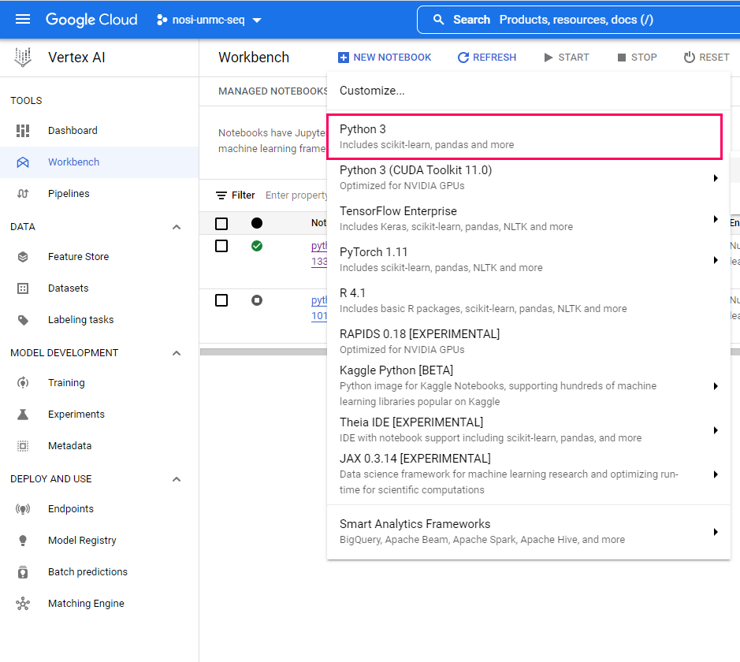
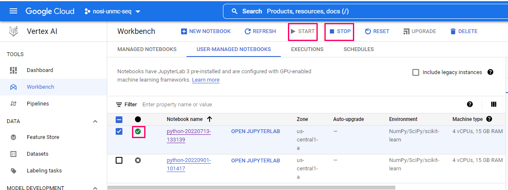
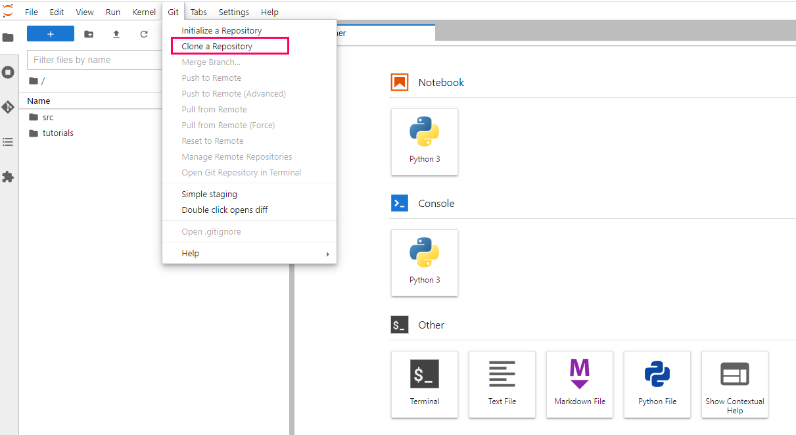
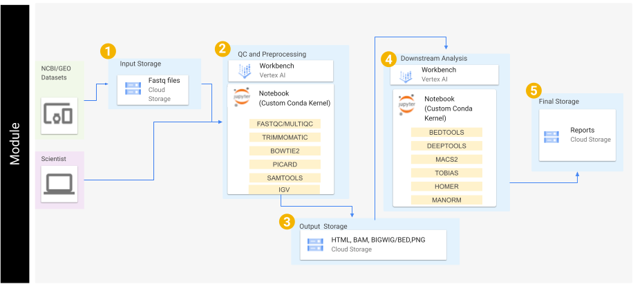
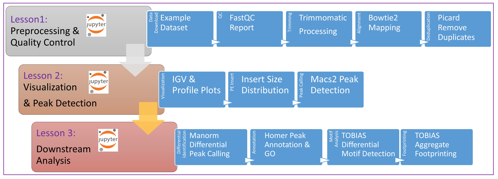

[comment]: <> (Hi. If you are seeing this message, please open this file with markdown preview or jupyter notebook. You can do this by right clicking on the readme file and picking 'open with'.)
# An open-source interactive pipeline tutorial for differential ATAC-seq footprint analysis
## INBRE Google Cloud Training Tutorials - ATAC-seq

## <a name="overview">Overview</a>

Included here are several tutorials in the form of 'Jupyter notebooks'.

The purpose of these tutorials is to help users familiarize themselves with the analysis steps for processing ATAC-seq data including considerations for single-end, paired-end or single-cell data.  

These tutorials do this by going step-by-step through specific workflows. These workflows cover the start to finish of basic bioinformatics analysis; starting from downloading raw sequence data, and extending to differential peak identification, genome annotation, and transcription factor footprinting, while producing common plots and visualizations.

## Table of Contents

<a href="#requirements">Requirements</a> 
<a href="#getting-started">Getting Started</a> 
<a href="#workflow">Workflows</a> 
<a href="#data">Data</a> 
<a href="#funding">Funding</a> 
 

## <a name="requirements">Requirements</a>

These tutorials were designed to be used on cloud computing platforms, with the aim of requiring nothing but the files within this github repository.

With this in mind, our tutorials use Jupyter Notebook files, which Google Cloud Platform, Amazon Web Service, and Microsoft Azure all provide support for. Therefore, requirements should only require creation of a virtual machine on one of these providers, and the downloading of this github's files to that machine.

For more information on creating a virtual machine and downloading our github to that machine, we have a getting started section below. Currently this section only includes information on how to do this using Google Cloud Platform.

## <a name="getting-started">Getting Started</a>

This repository contains several notebook files which serve as bioinformatics workflow tutorials.

The below steps guide you through setting up a virtual machine on Google Cloud Platform, downloading our tutorial files, and running those files. 

Accordingly, before starting, make sure you have a google account and have access to a Google Cloud Platform Project.

Once you have these, you can begin by first navigating to https://console.cloud.google.com/ and logging in with your credentials. Then, in the top left of the screen, navigate to 'select a project', and choose the project you belong to.

### Navigating to the Vertex AI Workbench

Once a project has been selected, we can navigate to the Vertex AI Workbench, this is where we can make our virtual machine. 
To get there, select the navigation menu, and navigate to 'Vertex AI' under the Artificial Intelligence section. 
Within the Vertex AI submenu, select 'Workbench'.

### Creating a Virtual Machine

Within the Workbench screen, Select the option to create a 'New Notebook'.

Our notebooks use python. You can then choose a name for your virutal machine, you can name it whatever you like, and preferably choose a server location closest to you. Ignore the advanced options for now, and a default virtual machine will be created. A default machine has 4 vCPUS and 15GB RAM.

Creating a machine may take a few minutes to finish.

### Starting Your Virtual Machine

To start your virtual machine by clicking 'Open Jupyerlab'. You will know it is running because of the green checkmark.

Note, when you are finished running code, you should turn off your virtual machine to prevent unneeded billing or resource use by checking your notebook and pushing the 'Stop' button. 

### Downloading Tutorial Files

Now that you have created your virtual machine, and are in the Jupyterlab screen, you can run our tutorial files. But first you will need to download them.
The easiest way to do this would probably be to clone our repository directly. This can be done by using the 'Git' menu in Jupyterlab, and selecting the clone option. 
Next you can type in the link of repository: "https://github.com/JRowleyLab/UNMC_ATACseqTutorial.git" (without quotation marks) and click 'Clone'. 

This should download our repo, and the tutorial files inside, into a folder called 'UNMC_ATACseq_Tutorial'. Double click this folder now. Inside you will find all our tutorial files, which you can double click and run.

### Running Tutorial Files

All our tutorial workflows are are Jupyter format. To run them you need only to double click the tutorial file you want.

This will open the Jupyter file in Jupyter notebook. From here you can run each section, or 'cell', of the code, one by one, by pushing the 'Play' button on the above menu. 

Some 'cells' of code take longer for the computer to process than others. You will know a cell is running when a cell has an asterisk next to it \[\*\]. When the cell finishes running, that asterisk will be replaced with a number which represents the order that cell was run in.

You can now explore the tutorials by running the code in each, from top to bottom. Look at the 'workflows' section below for a short description of each tutorial.

Jupyter is a powerful tool, with many useful features. For more information on how to use Jupyter, we recommend searching for Jupyter tutorials and literature online.

### Stopping Your Virtual Machine

When you are finished running code, you can turn off your virtual machine to prevent unneeded billing or resource use by checking your notebook and pushing the 'Stop' button.

## <a name="workflow">Workflows</a>

Our tutorials are broken down into 'workflows'. These can be downloaded and run locally, or you can use cloud services outlined in this Readme. For example, these notebooks have been tested in google cloud using the VertexAI to run Jupyter Notebooks.
 

Each notebook file covers a specific workflow, which contains written and visual commentary, as well as the actual step-by-step code for running that workflow analysis. 

For more information on how to run these in the cloud, navigate to the <a href="#getting-started">'Getting Started'</a> section. Feel free to explore ad use these workflows however works best for you. Each one builds from the previous tutorial, but they also can stand alone if you already know the concepts in the early ones. 

<strong><a href="ATACseq_Tutorial1_Preprocessing.ipynb">Tutorial One</a>:</strong> This short tutorial demonstrates the intial processing steps for ATAC-seq analysis. In this module we focus on generating quality reports of the fastq files, adapter trimming, mapping, and removal of PCR duplicates.

<strong><a href="ATACseq_Tutorial2_PeakDetection.ipynb">Tutorial Two</a>:</strong> In this section we will focus on visualization of the signal, create average plots of signal around transcription start sites (TSSs), and identification of peak signal.

<strong><a href="ATACseq_Tutorial3_Downstream.ipynb">Tutorial Three</a>:</strong> In this section we will focus on differential peak identification, motif footprinting, and annotation of nearby genomic features.

## <a name="data">Data</a>

In this tutorial we will process a randomly chosen published dataset. This is available from GEO: GSE67382 Bao X, Rubin AJ, Qu K, Zhang J et al. A novel ATAC-seq approach reveals lineage-specific reinforcement of the open chromatin landscape via cooperation between BAF and p63. Genome Biol 2015 Dec 18;16:284. PMID: 26683334

This dataset is paired-end 50 bp sequencing. We will analyze two samples representing NHEK cells with BAF depletion compared to a control. Note that to allow faster processing we have limited the reads to that of a specific region of chromosome 4.

## <a name="funding">Funding</a>

Funded by the INBRE Program (NIH/NIGMS P20 GM103427).
